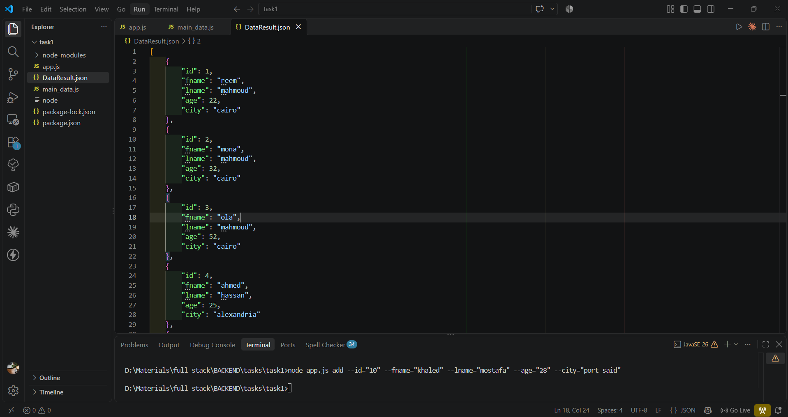
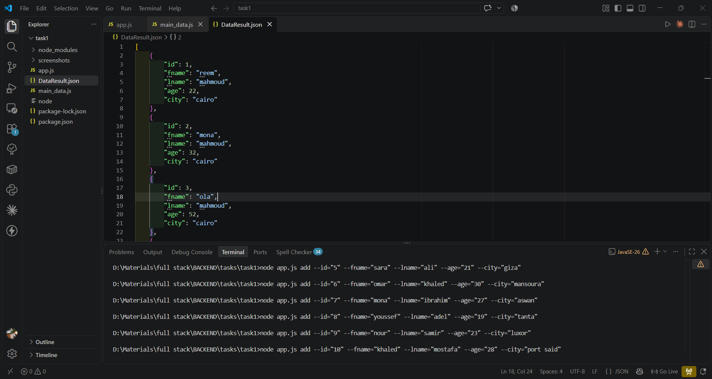
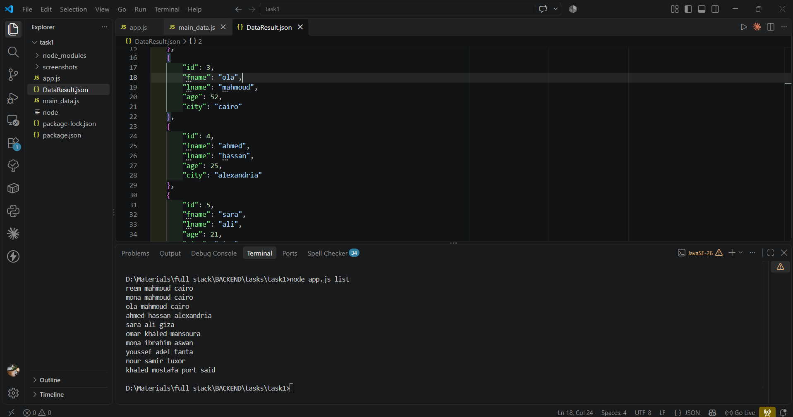
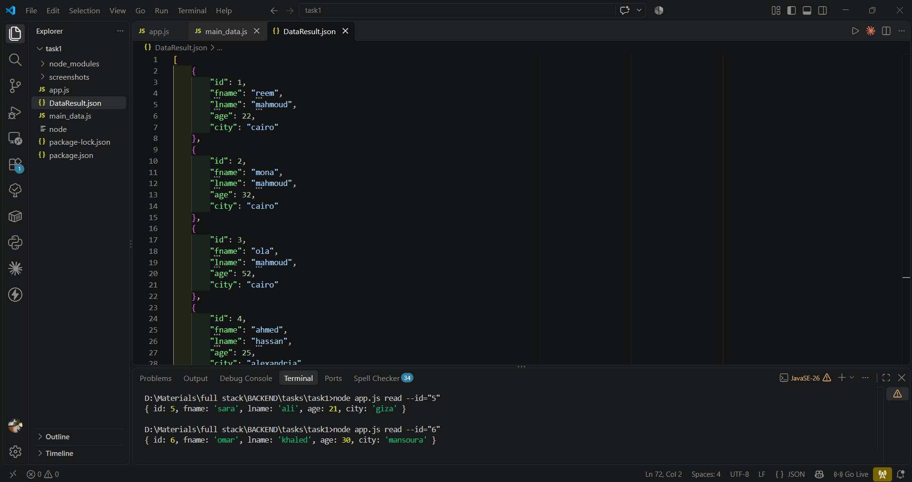
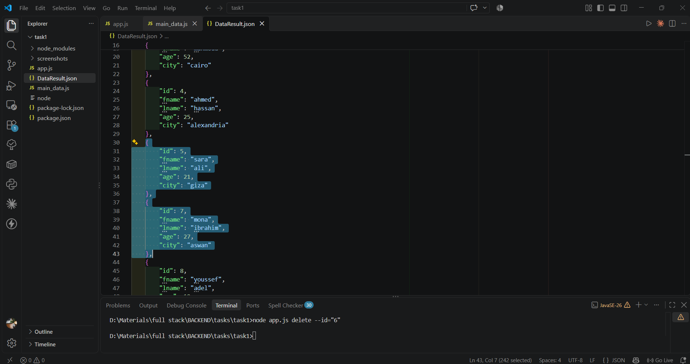
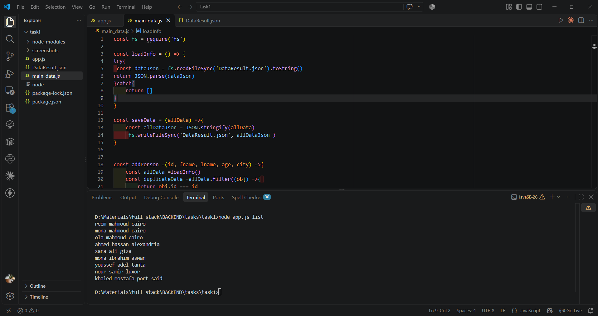
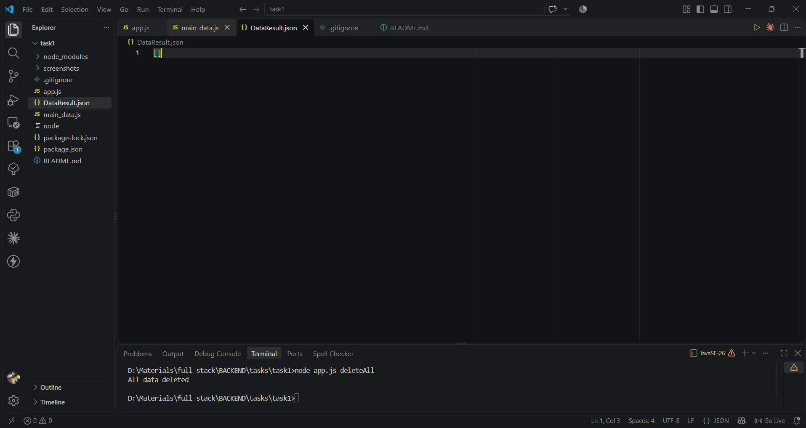
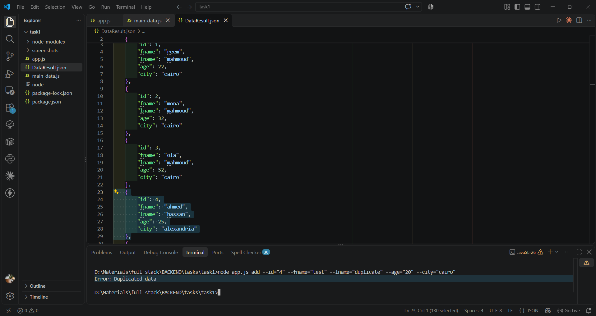
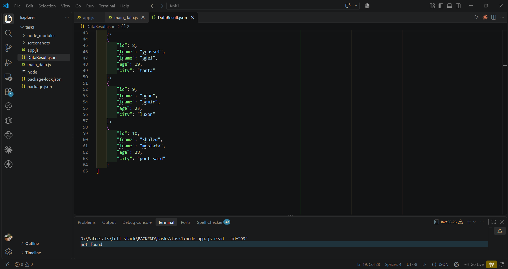

# People Manager CLI

A simple command-line app built with **Node.js** and **yargs** to manage people data stored in a JSON file.

## Task Requirements
1. The user enters the data of 10 people (id, first name, last name, age and city)
2. The user can view the data of all people or a specific person
3. The user can delete all people or a specific person
4. The user can view the full name (first name + last name) and the city of each person

## Features
- Add a person
- Read a person by id
- List all people (full name + city)
- Delete a person by id
- Delete all people
- Prevents duplicate ids

## Installation

```bash
git clone https://github.com/reemwebdev365-ai/people-manager-cli.git
cd people-manager-cli
npm install
```

## Usage

### Add a person
```bash
node app.js add --id="10" --fname="khaled" --lname="mostafa" --age="28" --city="port said"
```



### List all people
```bash
node app.js list
```


### Read a person by id
```bash
node app.js read --id="5"
```


### Delete a person by id
```bash
node app.js delete --id="6"
```




### Delete all people
```bash
node app.js deleteAll
```


## Error Handling

**Duplicate id:**
```bash
node app.js add --id="4" --fname="test" --lname="duplicate" --age="20" --city="cairo"
```


**Id not found:**
```bash
node app.js read --id="99"
```


## Tech Stack
- Node.js
- yargs
- File System (fs) module